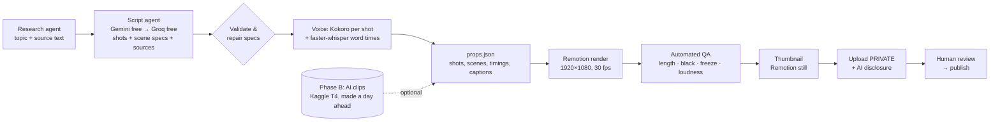

# Plan: Animated Explainer (Phase A) → AI Video Clips (Phase B)

_Status: approved direction, not started · Written 2026-09-29 · Branch `claude/busy-planck-wuvyw9`_

**Goal.** Replace the "one AI image + Ken Burns per section" renderer with
**animated explainer videos** (Phase A). Then add a few **AI-generated video clips** per video
for the hook and key moments (Phase B). **Hard constraint: $0.** Only free tiers, open-source
software and free compute.

**Why this order.** Phase A alone produces a complete, monetizable video on a CPU in about
15–30 minutes. Phase B only adds polish, because free GPU time only covers a few clips per video.
Every Phase B step must fall back to Phase A scenes, so a failure never blocks a video.

Proof-of-concept code (already on this branch):
- `poc/explainer/`: Remotion project, 10 hand-built scenes (the demo video)
- `poc/shot_video.py`: Kokoro voice, shot timing, FFmpeg crossfades, captions, A/V length check
- `poc/ai_video/wan_clips.py`: Wan 2.1 clip generator for a free Kaggle/Colab GPU (untested)

---

## 1. The free stack

| Job | Tool | Free limit (verify before relying on it) | What we need |
|---|---|---|---|
| Script writing | Gemini API free tier (Flash-Lite / older Flash) | Free-tier limits vary by model. Newest Flash models are ~20 req/day; older Flash-Lite are much higher | 2–5 requests per video |
| Script fallback | Groq free tier (non-Llama models) | ~30 req/min, ~1,000 req/day. **Llama left the free tier in Aug 2026** | 0–3 requests per video |
| Voice | Kokoro-82M via `kokoro-onnx` (Apache-2.0) | Unlimited, runs on CPU | ~350 MB model, cached |
| Word timings for captions | `faster-whisper` tiny/base on CPU (MIT) | Unlimited | ~1 min CPU per 8-min video |
| Animation | Remotion (free license: individuals / ≤3 employees, commercial and automated use allowed) | Unlimited, self-hosted | Chromium + Node on the runner |
| Icons | Lucide (ISC license) | Unlimited | npm package |
| Render compute | GitHub Actions standard runner | **Public repo: free, unmetered, 4 vCPU/16 GB. Private repo: 2,000 min/month, 2 vCPU/7 GB** | ~15 min (public) / ~30 min (private) per 8-min video |
| AI video (Phase B) | Kaggle notebook, T4 GPU, via `kaggle kernels push --accelerator NvidiaTeslaT4` | Weekly GPU quota (historically ~30 h/week; check your account) | ~1–1.5 h per video (4–6 clips) |
| AI video model | Wan 2.1 T2V 1.3B (Apache-2.0), ~8 GB VRAM | Unlimited | ~8–15 min per 5-s 480p clip on a T4 (estimate; benchmark in B0) |
| Queue / history | Supabase free tier (already used) or JSON files in the repo | Free-tier project limits | Tiny |
| Upload | YouTube Data API | 10,000 units/day. An upload is ~1,600 units | 1 upload/day plus thumbnail and captions |
| Alerts | GitHub's built-in email on workflow failure | Free | none |

**Remove or disable for free-only mode:** Claude API, AWS Bedrock, Veo / Vertex AI, the GCP VM and
GCS backup. They are paid or credit-based. See task A0.4.

---

## 2. Target architecture



**Script format (the contract between Python and Remotion).**
The LLM writes one narration line per shot, and gives each shot a scene from a fixed catalogue:

```json
{
  "title": "...", "description": "...", "tags": ["..."],
  "sources": [{"title": "...", "url": "..."}],
  "shots": [
    {"text": "An 8B model at 4-bit needs about five gigabytes.",
     "emphasis": ["five gigabytes"],
     "scene": {"type": "big_number", "props": {"value": 5, "unit": "GB", "label": "8B model at 4-bit"}}}
  ]
}
```

The props file that Python gives Remotion has the same shots, plus `start`, `duration`,
word-level caption timings, theme, and optional `clip` paths (Phase B).

---

## 3. Phase A: Animated explainer

### A0. Fix the existing pipeline first (prerequisites)
These bugs, found in the review, would break or embarrass the new renderer too.
| # | Task | Files |
|---|---|---|
| A0.1 | `--dry-run` must never upload. `_process_pending_scripts` currently ignores `dry_run` and marks failures only in memory | `orchestrator.py` |
| A0.2 | Upload as **private** and set `status.containsSyntheticMedia` (the AI voice is synthetic) | `agents/upload_agent.py`, `config.py` |
| A0.3 | Research: niche keyword filter, `html.unescape` titles, drop dead Reuters feeds, and save a topic to history **only after a successful upload**. Fetch the article text so the script is grounded in a real source | `agents/research_agent.py` |
| A0.4 | Add a `FREE_ONLY=true` guard (the default). It refuses paid providers (Claude, Bedrock, Veo, GCS) at startup and switches the default provider chain to Gemini free → Groq free. Update model names to ones on today's free tiers | `config.py`, `agents/script_agent.py` |
| A0.5 | Stop the legacy cron jobs and the Shorts-from-existing reposting (repetitive content under YouTube's rules) | `crontab_ubuntu.txt`, VM |
| A0.6 | Retire the old renderer as the default: add `VIDEO_STYLE` = `explainer` (new default) or `legacy` | `config.py`, `orchestrator.py` |

**Done when:** `orchestrator.py --dry-run` with `FREE_ONLY=true` runs research → script with no
paid key set and uploads nothing. Unit tests cover A0.1 and A0.4.

### A1. Scene catalogue and schema (Python side)
- New `agents/scene_schema.py`, with no new dependencies (plain dataclasses and checks). It holds:
  - the **catalogue**: `type` → allowed props, types, max text lengths, max list items, and a default
  - `validate_and_repair(script) -> script`: trims over-long text, clamps list sizes, coerces numbers,
    and replaces unknown or broken scenes with `key_point` (a big text card built from the shot's emphasis)
  - `catalogue_for_prompt()`: a compact text description of every scene, fed into the LLM prompt
- Catalogue v1 (14 scenes), each built so it can't overflow the screen at its limits:

| Scene | Use for | Key props |
|---|---|---|
| `title_hook` | first 3–6 s | headline, subline |
| `key_point` | default / fallback | text (≤ 40 chars), icon |
| `big_number` | one striking figure | value, unit, label, count_up |
| `compare` | A vs B | left{label,value}, right{label,value}, winner |
| `bar_chart` | 2–6 values | items[{label,value}], unit |
| `line_trend` | change over time | points[{x,y}], unit, highlight |
| `steps` | how-to sequences | items[≤5] |
| `checklist` | requirements | items[≤5], checked[] |
| `icon_grid` | several things at once | items[≤6]{icon,label} |
| `meter` | share / fits-in / capacity | value, max, label |
| `terminal` | commands, code | lines[≤4] |
| `chat` | AI assistant examples | messages[≤3]{from,text} |
| `timeline` | history, releases | events[≤5]{date,label} |
| `quote` | a sourced statement | text, attribution |
| `cta_end` | last shot | question, subscribe line |

**Tests (pytest, `tests/test_scene_schema.py`):** every scene's default passes; over-long text is
trimmed; an unknown type becomes `key_point`; missing props get defaults; a fuzz test of 500
random, broken specs never raises.

### A2. Remotion scene library (the POC made data-driven)
- Move `poc/explainer` → `video/explainer/`. Replace the hard-coded `data.ts` with **input props**
  (`--props=props.json`), and use `calculateMetadata` to set the video length from the shots.
- `src/scenes/<Type>.tsx`, one component per catalogue entry, plus a `registry.ts` mapping type → component.
- Shared parts: `Captions` (word-level highlight from whisper timings), `Progress`, `Background`, a `Theme`
  per niche (colors, fonts), and transitions via `@remotion/transitions` (free, same license).
- `Thumbnail` composition, rendered with `remotion still`, so thumbnails match the video's look.
- Fonts bundled in the repo (e.g. Inter or Liberation, both free licenses) so renders look the same on every machine.

**Tests:**
- `npm run test:scenes`: render a still of every scene with 3 fixtures (typical / longest allowed /
  most items). Compare against golden PNGs (pixel-diff threshold ~1%). Update goldens deliberately
  with `npm run test:scenes -- --update`.
- Overflow test: load each fixture in headless Chromium (Playwright is already on the machine) and assert that no
  text element's `scrollWidth > clientWidth` and nothing is positioned outside 1920×1080.
- `npx tsc --noEmit` passes.

### A3. Voice and timing
- Promote the POC's Kokoro code into `agents/voice_agent.py` as `VOICE_ENGINE=kokoro` (new default).
  Keep edge-tts as the second choice and pyttsx3 as the last resort. Model files are cached in
  `~/.cache/autotube/kokoro`; CI caches them with `actions/cache`.
- Synthesize **one line per shot** (as in the POC). Shot length = its audio + 0.28 s pause, with
  frame-exact boundaries.
- Word timings: run `faster-whisper` on each shot's audio (the text is known, so this only aligns it) → word start/end
  → captions highlight the word being spoken. If whisper fails, fall back to the POC's
  proportional timing.
- Loudness: normalize the voice in a separate pass to −16 LUFS. **Not inside the mix graph**:
  the POC showed that cuts the last ~3 s.

**Tests:** timing math (sum of frames = audio length ±1 frame); caption words are in order and
don't overlap; a fixture WAV aligns with ≥ 90 % of words within 0.15 s of hand-marked times.

### A4. Explainer render agent
- New `agents/explainer_agent.py`: script → `validate_and_repair` → voice → `props.json` →
  `npx remotion render ... --props=props.json` → QA (A6) → thumbnail. It returns the same dict shape as
  `VideoAgent.render()` so `orchestrator.py` needs only a `VIDEO_STYLE` switch.
- Render flags: `--concurrency` = CPU count, `--crf 20`, and `--timeout` scaled to video length.
  If a render fails, retry once at lower concurrency. After that, fail loudly (never upload a partial video).
- Background music: keep CC0 tracks only, and add them in Remotion with volume ducking under speech segments.

**Tests:** a golden-path integration test in CI: a fixture script (no LLM call) → 30-s video →
QA passes. A failure-injection test: a corrupt scene spec → it renders with `key_point` and the video still passes QA.

### A5. Script prompt v2 (quality and YouTube-rule safety)
- New prompt in `templates/prompts.py`: an original angle on the topic, with a **source excerpt**
  included. The rules: _no statistic that is not in the source; say "about"/"roughly" for estimates;
  no "I tested" claims_. The model returns `shots` with scene specs chosen from `catalogue_for_prompt()`.
- Target is ~1,100–1,200 words (8+ min) as ~90–110 shots of 4–7 s each.
- **Repair loop:** parse → validate. If it's still invalid, send the errors back to the model once. Then
  apply automatic repair (never a hard failure for a scene problem).
- **Number check:** every number in the narration must appear in the source excerpt, or be flagged
  in the report for the human reviewer.
- Description includes the sources and chapter timestamps from the real shot times.

**Tests:** parser handles fenced / truncated / extra-text JSON (fixture set); the number checker
flags an invented percentage; the prompt size stays within free-tier token limits.

### A6. Automated video QA (`scripts/qa_video.py`, runs after every render)
It fails the run (no upload) if any check fails:
| Check | Tool | Threshold |
|---|---|---|
| Video length = audio length = narration | ffprobe | ±0.1 s |
| Resolution / fps / codec | ffprobe | 1920×1080, 30 fps, h264 + aac |
| No black gaps | `ffmpeg -vf blackdetect` | none > 0.5 s |
| No frozen picture | `ffmpeg -vf freezedetect` | none > 4 s (animations should always move) |
| Loudness | `ffmpeg -af ebur128` | −16 LUFS ±2, true peak < −1 dB |
| Captions present | props check | ≥ 95 % of words have timings |
| Minimum length | ffprobe | ≥ 8:00 for long-form |

**Tests:** fixture videos with each defect (black gap, freeze, silent tail, short audio) must each fail.

### A7. GitHub Actions workflow (`.github/workflows/explainer.yml`)
- Triggers: `workflow_dispatch` (inputs: topic, dry_run) and later a daily `schedule`.
- Steps: checkout → setup Python and Node (with caching) → `apt install ffmpeg fonts` →
  cache the Kokoro and whisper models → `npm ci` → install Remotion's browser (`npx remotion browser ensure`) →
  `python orchestrator.py --style explainer` → upload `outputs/` (video, report, props) as a
  workflow artifact kept 7 days → upload to YouTube as **private**.
- Secrets: `GEMINI_API_KEY`, `GROQ_API_KEY` (optional), `YOUTUBE_TOKEN_JSON`,
  `YOUTUBE_CLIENT_SECRETS`. Write them with `printf '%s' "$SECRET" > file` from `env:`, not
  `echo '${{ }}'` (the current workflow breaks on quotes).
- Delete `prefetch_pipeline.yml`, which spends LLM calls every 6 h on a queue that is never rendered.

**Time budget.** The POC rendered 60 s in 100 s on 4 cores, so an 8-min video takes about 15 min (public repo, 4 vCPU)
or about 30 min (private repo, 2 vCPU), plus ~5 min setup. At 1 video/day that's about 1,050 min/month on a private
repo, which fits the 2,000 free minutes. A public repo has no limit.

### A8. Staged rollout (human in the loop)
1. **Offline e2e (CI):** fixture script → full render → QA. Runs on every push.
2. **Staging runs (×5):** real research and LLM, `dry_run=true`. Watch every video. Score 1–5 on
   accuracy, pacing, visuals and audio; fix prompts and scenes until the average is ≥ 4.
3. **Private uploads (×5):** real uploads as private. Check the YouTube processing, the thumbnail, the
   captions and the disclosure flag.
4. **Go live:** 1 video every 1–2 days. You publish each one manually after a 2-min check (or approve by WhatsApp).
5. **Weekly review:** click-through rate and average view duration in YouTube Studio → adjust topics, hooks and scenes.

**Phase A done when:** 5 consecutive scheduled runs produce videos that pass QA with no manual fixes, each ≥ 8 min,
and your rating averages ≥ 4.

---

## 4. Phase B: AI video clips (free GPU)

**Scope.** 4–6 AI clips per video: the hook (first 5–10 s) plus 3–5 visual moments that the script
marks as `"scene": {"type": "ai_clip", "props": {"prompt": "...", "fallback": {...}}}`.
Everything else stays explainer scenes. Each `ai_clip` carries a fallback scene, so a missing
clip never blocks a video.

### B0. Feasibility benchmark: the go/no-go gate (manual, ~1 evening)
- Run `poc/ai_video/wan_clips.py` in a Kaggle notebook (GPU T4, Internet on) with 20 prompts
  from real scripts. Record the time per clip, peak VRAM, and a 1–5 quality score for each clip.
- If it's too slow or poor, try alternatives on the same setup: Wan 2.1 1.3B at fewer steps,
  LTX-Video (distilled, faster), and Wan 2.2 TI2V-5B with CPU offload.
- **Pass criteria:** ≤ 12 min per clip on average, and ≥ 60 % of clips scored ≥ 3 (no warped hands or faces,
  no text artifacts). **If nothing passes, stop Phase B.** Phase A is already a complete product.

### B1. Kaggle kernel (automated GPU job)
- `ai_video/kaggle/`: `generate.py` (hardened from the POC), and `kernel-metadata.json` with
  `enable_gpu: true`, `enable_internet: true`, pushed with `--accelerator NvidiaTeslaT4`.
- Input: a small `shots.json` pushed with the kernel. Output: `clip_XX.mp4` plus `manifest.json`
  (prompt, seed, seconds, status for each clip).
- Inside the same GPU session (free): upscale 832×480 → 1920×1080 with Real-ESRGAN, and
  interpolate 16 → 30 fps with RIFE. If either tool fails, fall back to FFmpeg scaling and frame duplication.
- Skip clips that already exist and write the manifest after each clip, so a timed-out session keeps its finished clips.

**Tests:** run the kernel with a 1-clip / 10-step config (fast smoke test); `manifest.json` validates;
every clip passes the A6 checks for duration and black frames.

### B2. Orchestration from GitHub Actions (`agents/ai_clip_agent.py` and `ai_clips.yml`)
- **Prefetch a day ahead:** after the script is written (Phase A pipeline split: script today,
  render tomorrow), the workflow runs `kaggle kernels push`, then polls
  `kaggle kernels status` every 5 min (maximum ~3 h), then `kaggle kernels output` → saves the clips as a
  workflow artifact / in the Supabase queue record → the next day's render job downloads them.
- Secrets: `KAGGLE_USERNAME`, `KAGGLE_KEY` (free account, phone-verified for GPU).
- **Quota guard:** track GPU minutes used this week in a small JSON file. If a run would go over
  ~80 % of the weekly quota, skip AI clips and use the fallback scenes.

**Tests:** mocked Kaggle CLI (success / timeout / error) → the agent returns the clips or a clean
"use fallback" result; a real end-to-end run on a 1-clip script.

### B3. Rendering AI clips in Remotion
- New `ai_clip` scene: `<OffthreadVideo>` of the clip, a slow push-in, the niche color grade,
  captions on top, and a small corner tag "AI-generated footage". Clips shorter than the shot
  play slowed a little (≥ 0.8×) or end on a freeze-frame, never a cut to black.
- The upload sets `containsSyntheticMedia: true` whenever any AI clip is used (it's always set anyway
  because of the synthetic voice).

**Tests:** scene snapshot with a fixture clip; the render uses the fallback scene when the clip file is
missing or broken (failure injection); the A6 QA passes.

### B4. Clip QA and rollout
- Automated: duration, resolution after upscaling, blackdetect, and freezedetect (an AI clip must move).
- Manual for the first 10 videos: reject clips with deformed people, text artifacts or anything
  misleading. Make the prompts prefer objects, places and abstract scenes over people.
- **Phase B done when:** 10 consecutive videos include ≥ 3 usable AI clips each, stay within
  the weekly GPU quota, and need no manual fixes.

---

## 5. Cross-cutting rules
- **YouTube rules:** an original script with a clear angle; no invented numbers; sources in the
  description; AI disclosure on; no reposting of old videos as Shorts; ≤ 1 video/day.
- **$0 guard:** `FREE_ONLY=true` is the default and CI fails if a paid provider is configured.
- **Never publish a broken video:** the QA gate plus private upload plus human publish.
- **Everything reproducible:** `report.json` for each run (topic, sources, model, seeds, timings,
  QA results) is saved as an artifact.

## 6. Order of work
| Step | Contents | Rough size |
|---|---|---|
| 1 | A0 fixes + unit test setup (`pytest`, CI job) | 1 session |
| 2 | A1 schema + A2 scene library (14 scenes, snapshot and overflow tests) | 2–3 sessions |
| 3 | A3 voice/timing + A4 render agent + A6 QA | 1–2 sessions |
| 4 | A5 prompt v2 + A7 workflow | 1 session |
| 5 | A8 staging runs and tuning (needs you to review videos) | ~1 week of calendar time |
| 6 | B0 benchmark (you run the notebook, ~1 evening) → go / no-go | 1 session |
| 7 | B1–B3 Kaggle kernel, orchestration, `ai_clip` scene | 2 sessions |
| 8 | B4 rollout | ~2 weeks of calendar time |

## 7. Decisions needed from you
1. **Public or private repo?** Public means free, unlimited, faster (4 vCPU) renders. Private means 2,000
   min/month (enough for 1 video/day) and ~2× slower renders. Secrets stay secret either way.
2. **New channel or keep the existing one?** The existing channel has 131 mixed-quality uploads.
3. **Sub-niche.** Something narrower than "AI & Tech", e.g. "running and using AI tools yourself".
4. **Voice.** Pick one Kokoro voice (e.g. `am_michael`, `af_heart`, `bm_george`) and keep it.
5. **Review step.** Manual publish in YouTube Studio, or the existing WhatsApp approval flow.

## 8. Risks
| Risk | Mitigation |
|---|---|
| Free-tier LLM limits or models change (e.g. Groq dropping Llama) | Provider chain with a config-driven model list; the A5 repair loop; a pre-flight check at startup |
| Kaggle quota or policy changes | Phase B is optional by design; quota guard; fallback scenes |
| Monotonous visuals (same 14 scenes) | Themes, randomized layouts within each scene, grow the catalogue from analytics |
| LLM picks the wrong scene | Validation and repair; the prompt shows examples; reviewers flag mismatches |
| Render too slow on a 2-vCPU private runner | Public repo, or reduce concurrency / 1080p24; tune after A8 |
| Remotion license changes | Pin the version; the free license covers individuals and ≤3-person companies today |

## Sources checked while writing this plan
- Remotion license: https://www.remotion.dev/docs/license/faq
- Gemini API rate limits: https://ai.google.dev/gemini-api/docs/rate-limits
- Groq rate limits: https://console.groq.com/docs/rate-limits and https://klymentiev.com/blog/groq-pricing
- Kaggle CLI kernels (`--accelerator`, `enable_gpu`): https://github.com/Kaggle/kaggle-cli/blob/main/docs/kernels.md
- GitHub Actions billing: https://docs.github.com/billing/managing-billing-for-github-actions/about-billing-for-github-actions
- YouTube `status.containsSyntheticMedia`: https://developers.google.com/youtube/v3/revision_history
- Wan 2.1 on T4 (community reports): https://www.kaggle.com/code/cameronburroughs/wan21-i2v-1-3b-model-test-t4-gpu , https://willitrunai.com/blog/wan-2-2-vram-requirements
- YouTube inauthentic-content policy: https://support.google.com/youtube/answer/1311392
